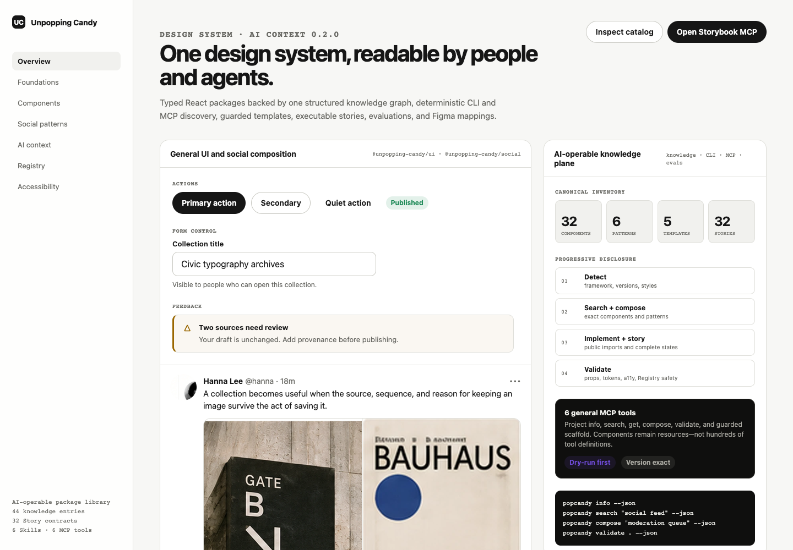

# Unpopping Candy

Unpopping Candy is a React design system for social, content, moderation, and collaboration interfaces, with the same versioned contracts exposed to developers and coding agents.

It combines accessible UI primitives, controlled social presentation components, semantic tokens, Storybook contract stories, and a deterministic local catalog. Agents can discover the installed system before editing instead of guessing component names, props, states, or imports.



## Why it is different

Most component libraries stop at rendered components and prose documentation. Unpopping Candy keeps typed public APIs, adjacent guidance, semantic tokens, Storybook stories, Registry templates, and machine-readable catalog entries aligned through repository checks.

The social layer is deliberately controlled and API-agnostic. It presents posts, profiles, notifications, conversations, composers, and timelines through view models and callbacks. That makes the components reusable across collaboration products without choosing an API, router, cache, authentication scheme, or server entity model.

The AI-operable layer is deterministic. The local `popcandy` CLI detects installed versions, searches the exact catalog, returns full contracts by stable ID, proposes bounded compositions, and validates source. It does not call a model and it does not replace visual or accessibility review.

## What application code still owns

Consuming applications own:

- fetching, caching, retries, mutations, and realtime transport;
- routing, URLs, navigation, and deep links;
- authentication, authorization, JWTs, and policy decisions;
- API DTOs, server entities, persistence, uploads, and analytics;
- draft, pending, optimistic, success, and failure workflow state;
- localization content and product-specific accessibility decisions.

`@unpopping-candy/ui` and `@unpopping-candy/social` remain presentation packages. Do not move TanStack Query, SWR, Zustand, routers, API clients, or business workflows into them.

## Repository-implemented in Stage 0

The committed catalog is version `0.2.0` and contains 32 public component contracts, six product patterns, five local Registry templates, and one migration record.

Stage 0 currently implements in this repository:

- reference, semantic, and component tokens;
- scoped light, dark, system, high-contrast, density, and accent themes;
- semantic icon wrappers;
- general layout, form, feedback, loading, dialog, tabs, and display primitives;
- controlled social post, composer, profile, user, notification, conversation, and timeline views;
- 32 dedicated Storybook contract stories;
- generated catalog, portable agent documents, Skills, and the local public-package candidates for CLI, MCP, and Registry;
- private repository tools for deterministic static evaluation and placeholder-gated Code Connect generation;
- retained packed-consumer compatibility evidence covering all 140 clean-consumer cells at its documented source commit.

See the [catalog manifest](./agent/manifests/catalog.json) and [Storybook usage source](./apps/docs/stories/Introduction.mdx). No hosted Storybook URL is configured in this repository.

## Roadmap, not current API

- Stage 1 plans choice and collection forms: Checkbox, Radio, Switch, Select, ComboBox, and ListBox families.
- Stage 2 plans Menu, Popover, Tooltip, Disclosure, and Accordion interactions.
- Stage 3 plans Breadcrumbs, Pagination, Table, DataGrid, and Progress.

Those names are reserved roadmap work, not imports available in the Stage 0 catalog. The detailed plans live under [`docs/superpowers/plans`](./docs/superpowers/plans/2026-08-11-unpopping-candy-competitive-release-index.md).

## Local Vite quickstart

The packages are not published to npm. This single copy/paste POSIX-shell path builds and packs the current checkout, creates a clean Vite app, installs all nine Unpopping Candy packages from local tarballs, writes a small token-based screen, runs the five local CLI commands, builds, and checks a bounded preview.

Prerequisites: a POSIX shell with `sh`, Git, Node `>=22.13.0`, Corepack, `curl`, and a clone of this repository. Run from the repository root:

```bash
set -eu
corepack prepare pnpm@11.4.0
corepack pnpm install --frozen-lockfile

PACK_ROOT="$(mktemp -d)"
APP_PARENT="$(mktemp -d)"
node --input-type=module - "$PACK_ROOT" <<'NODE'
import { packPublicWorkspace } from './scripts/run-compatibility-matrix.mjs';
await packPublicWorkspace({ workspaceRoot: process.cwd(), outputRoot: process.argv[2] });
NODE

cd "$APP_PARENT"
corepack pnpm create vite@8.1.0 popcandy-vite --template react-ts
cd popcandy-vite
mkdir packs
for PACKAGE in tokens theme icons ui social; do
  cp "$PACK_ROOT/unpopping-candy-$PACKAGE-0.1.0.tgz" packs/
done
for PACKAGE in knowledge registry cli mcp; do
  cp "$PACK_ROOT/unpopping-candy-$PACKAGE-0.2.0.tgz" packs/
done

node --input-type=module <<'NODE'
import { readFile, writeFile } from 'node:fs/promises';
const manifest = JSON.parse(await readFile('package.json', 'utf8'));
manifest.packageManager = 'pnpm@11.4.0';
manifest.scripts.popcandy = 'popcandy';
manifest.devDependencies.vite = '8.1.0';
manifest.devDependencies['@vitejs/plugin-react'] = '6.0.1';
manifest.dependencies = {
  ...manifest.dependencies,
  '@unpopping-candy/cli': 'file:./packs/unpopping-candy-cli-0.2.0.tgz',
  '@unpopping-candy/icons': 'file:./packs/unpopping-candy-icons-0.1.0.tgz',
  '@unpopping-candy/knowledge': 'file:./packs/unpopping-candy-knowledge-0.2.0.tgz',
  '@unpopping-candy/mcp': 'file:./packs/unpopping-candy-mcp-0.2.0.tgz',
  '@unpopping-candy/registry': 'file:./packs/unpopping-candy-registry-0.2.0.tgz',
  '@unpopping-candy/social': 'file:./packs/unpopping-candy-social-0.1.0.tgz',
  '@unpopping-candy/theme': 'file:./packs/unpopping-candy-theme-0.1.0.tgz',
  '@unpopping-candy/tokens': 'file:./packs/unpopping-candy-tokens-0.1.0.tgz',
  '@unpopping-candy/ui': 'file:./packs/unpopping-candy-ui-0.1.0.tgz',
};
await writeFile('package.json', `${JSON.stringify(manifest, null, 2)}\n`);
NODE

tee pnpm-workspace.yaml >/dev/null <<'YAML'
allowBuilds:
  esbuild: true
onlyBuiltDependencies:
  - esbuild
overrides:
  '@unpopping-candy/cli': file:./packs/unpopping-candy-cli-0.2.0.tgz
  '@unpopping-candy/icons': file:./packs/unpopping-candy-icons-0.1.0.tgz
  '@unpopping-candy/knowledge': file:./packs/unpopping-candy-knowledge-0.2.0.tgz
  '@unpopping-candy/mcp': file:./packs/unpopping-candy-mcp-0.2.0.tgz
  '@unpopping-candy/registry': file:./packs/unpopping-candy-registry-0.2.0.tgz
  '@unpopping-candy/social': file:./packs/unpopping-candy-social-0.1.0.tgz
  '@unpopping-candy/theme': file:./packs/unpopping-candy-theme-0.1.0.tgz
  '@unpopping-candy/tokens': file:./packs/unpopping-candy-tokens-0.1.0.tgz
  '@unpopping-candy/ui': file:./packs/unpopping-candy-ui-0.1.0.tgz
YAML

corepack pnpm install --frozen-lockfile=false

tee src/App.tsx >/dev/null <<'TSX'
import { UnpoppingCandyProvider } from '@unpopping-candy/theme';
import { Button, Stack, Surface } from '@unpopping-candy/ui';
import '@unpopping-candy/tokens/styles.css';
import '@unpopping-candy/ui/styles.css';
import './App.css';

export default function App() {
  return (
    <UnpoppingCandyProvider storageKey={false}>
      <main>
        <Surface border padding="lg">
          <Stack gap={4}>
            <h1>Unpopping Candy</h1>
            <p>Local tarballs, public imports, and semantic tokens.</p>
            <Button variant="primary">Continue</Button>
          </Stack>
        </Surface>
      </main>
    </UnpoppingCandyProvider>
  );
}
TSX

tee src/App.css >/dev/null <<'CSS'
:root {
  font-family: var(--popcandy-font-sans);
  color: var(--popcandy-ink);
  background: var(--popcandy-canvas);
}
main { padding: var(--popcandy-space-6); }
CSS

tee src/index.css >/dev/null <<'CSS'
body { margin: var(--popcandy-space-0); }
CSS

corepack pnpm build
npm run popcandy -- info --path . --json
npm run popcandy -- search "publish post" --path . --json
npm run popcandy -- get social.post-composer-view --path . --json
npm run popcandy -- compose "publish a post with pending, success, and error states" --path . --json
npm run popcandy -- validate --path . --json

corepack pnpm preview --host 127.0.0.1 >preview.log 2>&1 &
PREVIEW_PID=$!
trap 'kill "$PREVIEW_PID" 2>/dev/null || true' EXIT INT TERM
ATTEMPTS=0
until curl --fail --silent http://127.0.0.1:4173/ >/dev/null; do
  ATTEMPTS=$((ATTEMPTS + 1))
  [ "$ATTEMPTS" -lt 30 ] || { cat preview.log; exit 1; }
  sleep 1
done
kill "$PREVIEW_PID"
wait "$PREVIEW_PID" 2>/dev/null || true
trap - EXIT INT TERM
```

The packer requires the source repository's exact `pnpm@11.4.0`, builds all nine public packages in dependency order, and emits isolated `.tgz` artifacts. The consumer pins Vite `8.1.0` and `@vitejs/plugin-react` `6.0.1`; the bounded preview terminates automatically. The temporary directories can then be removed.

## Local agent workflow

Run these exact commands from an installed consumer project whose `package.json` and optional `popcandy.config.json` identify its Unpopping Candy packages:

```bash
npm run popcandy -- info --path . --json
npm run popcandy -- search "publish post" --path . --json
npm run popcandy -- get social.post-composer-view --path . --json
npm run popcandy -- compose "publish a post with pending, success, and error states" --path . --json
npm run popcandy -- validate --path . --json
```

Use the results in order: confirm versions, discover candidates, inspect every selected stable ID, compose a state-complete plan, implement through public entrypoints, add or update Storybook stories, then validate. Registry scaffolding remains dry-run by default and requires a separate explicit `--apply` action.

The full operating contract is in [AGENTS.md](./AGENTS.md); CLI details are in [docs/CLI.md](./docs/CLI.md).

## Package map

### Public package candidates

Nine packages are local public-package candidates. None is a supported npm release yet:

| Package                      | Version | Role                                                                        |
| ---------------------------- | ------- | --------------------------------------------------------------------------- |
| `@unpopping-candy/tokens`    | 0.1.0   | Reference, semantic, and component tokens plus CSS and JSON exports.        |
| `@unpopping-candy/theme`     | 0.1.0   | React theme, density, accent, persistence, and scoped variables.            |
| `@unpopping-candy/icons`     | 0.1.0   | Semantic icon names backed by Ant Design Icons.                             |
| `@unpopping-candy/ui`        | 0.1.0   | Accessible, product-independent React presentation components.              |
| `@unpopping-candy/social`    | 0.1.0   | Controlled, API-agnostic social and collaboration presentation.             |
| `@unpopping-candy/knowledge` | 0.2.0   | Canonical catalog types, validation, search, and generators.                |
| `@unpopping-candy/registry`  | 0.2.0   | Versioned local templates with checksums, dry-run plans, and guarded apply. |
| `@unpopping-candy/cli`       | 0.2.0   | Deterministic project detection, discovery, composition, and validation.    |
| `@unpopping-candy/mcp`       | 0.2.0   | Thin local MCP adapter over the same knowledge and guarded services.        |

### Private tooling

Two packages are private repository tooling and are not publication targets:

| Package                  | Version | Role                                                                 |
| ------------------------ | ------- | -------------------------------------------------------------------- |
| `@unpopping-candy/evals` | 0.2.0   | Deterministic static evaluation of generated interface source.       |
| `@unpopping-candy/figma` | 0.2.0   | Code Connect manifest validation and parserless template generation. |

## Verification

Use the same gates maintainers use:

```bash
npm run agent:check
npm run test:pure
npm run verify
pnpm typecheck
pnpm build
```

Launch, test, and statically build the local Storybook from the repository root with:

```bash
pnpm --filter @unpopping-candy/docs dev
pnpm test:storybook
pnpm --filter @unpopping-candy/docs build-storybook
```

Compatibility is defined in [docs/COMPATIBILITY.md](./docs/COMPATIBILITY.md). Its retained evidence records all 140 planned tarball-only cells passing at the exact historical source commit named in that policy, across four fixtures, seven framework/React combinations, and five package managers.

## Trust and project policies

- [AI-assisted publish-a-post case study](./docs/AI_ASSISTED_POST_CASE_STUDY.md)
- [Compatibility](./docs/COMPATIBILITY.md)
- [Accessibility](./docs/ACCESSIBILITY.md)
- [Support](./docs/SUPPORT.md)
- [Security](./docs/SECURITY.md)
- [Versioning](./docs/VERSIONING.md)
- [Storybook and AI usage](./docs/STORYBOOK_AI.md)
- [Catalog architecture](./docs/AI_CONTEXT_ARCHITECTURE.md)
- [Contribution and public component requirements](./docs/COMPONENT_GUIDELINES.md)

## Current limitations

- The nine public packages are not published to npm; use locally packed artifacts for adoption checks.
- All generated Code Connect entries still have placeholder Figma mappings, so the publish gate intentionally fails.
- There is no remote Registry. Registry reads and guarded writes use committed local templates.
- There is no hosted MCP service. The MCP package and examples are local-only.
- No authorized fresh real-model capture exists for the publish-a-post slice, so Stage 0 makes no public model-quality claim.
- Automated Chromium/axe-compatible checks do not substitute for the unexecuted manual assistive-technology lanes in the accessibility policy.

## Contributing

Fork the [GitHub repository](https://github.com/julymeltdown/unpopping-candy-design), create a focused branch in your fork, follow [AGENTS.md](./AGENTS.md), and open a pull request against the repository with the commands and outcomes you executed. Search and inspect the installed catalog, use only public imports and semantic tokens, keep business ownership in applications, and add visible states to Storybook. A public component also requires adjacent metadata, typed ref/native behavior, accessibility guidance, tests, generated contracts, a Changeset, and the full verification set in [component guidelines](./docs/COMPONENT_GUIDELINES.md). Use [GitHub issues](https://github.com/julymeltdown/unpopping-candy-design/issues) for scoped bugs, proposals, or contribution questions; report vulnerabilities privately through the security policy.

Publication, deployment, provider calls, Figma publication, remote writes, and model execution require explicit external authorization. Request it in a GitHub issue or pull request that names the exact action and target, then wait for a repository owner to approve that action before execution. Security-sensitive requests use private vulnerability reporting instead. Local checks and dry runs are evidence, not permission to perform those actions.
