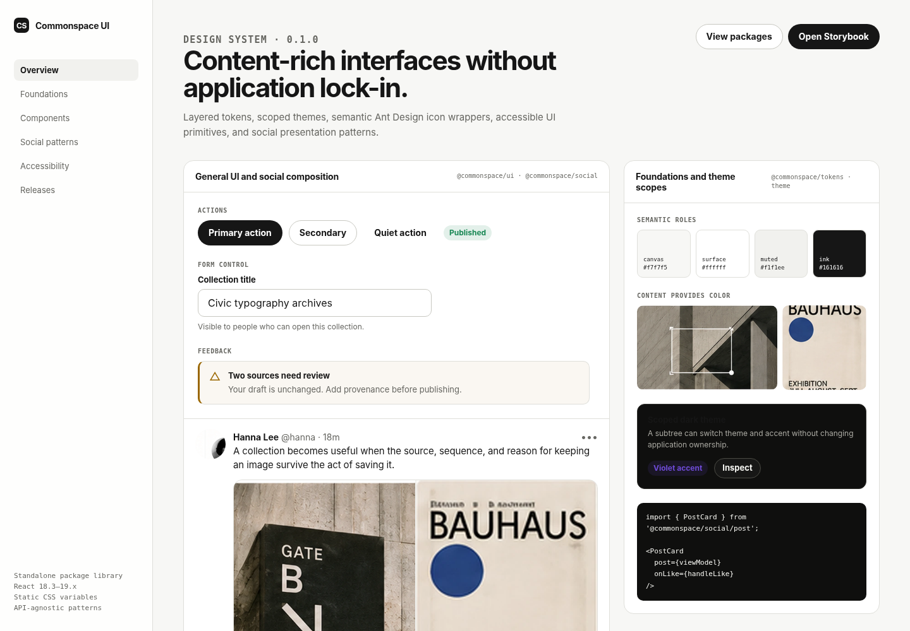

# Commonspace UI

A standalone React design system for content-rich, social, editorial, and community products.

Commonspace UI extracts the reusable visual layer from the Commonspace social reference application and turns it into independently versioned packages. The library provides layered design tokens, scoped themes, semantic Ant Design icon wrappers, accessible general-purpose UI components, and API-agnostic social presentation patterns.

It deliberately does **not** contain authentication, JWT handling, TanStack Query, SWR, Zustand, React Router, Feature-Sliced Design application code, or backend services. Those concerns belong to an application kit. This repository is the visual and interaction contract only.



The image above is a static documentation preview rendered from the package CSS and local representative content assets. Interactive behavior is documented and tested separately.

> **Repository status:** implemented as a publishable-package monorepo, with offline architecture and pure-logic verification. Dependency-aware Vite, Storybook, and consumer builds are configured but require a successful package installation. See [Verification status](#verification-status).

## What this repository provides

| Package | Purpose | Owns network or application state? |
|---|---|---:|
| [`@commonspace/tokens`](./packages/tokens) | Reference, semantic, and component tokens | No |
| [`@commonspace/theme`](./packages/theme) | Theme, density, accent, and document/local scoping | No |
| [`@commonspace/icons`](./packages/icons) | Semantic icon API backed by Ant Design Icons | No |
| [`@commonspace/ui`](./packages/ui) | Product-independent accessible React components | No |
| [`@commonspace/social`](./packages/social) | Social presentation models and composed UI patterns | No |

The repository also contains:

- [`apps/docs`](./apps/docs): Storybook component catalog.
- [`apps/playground`](./apps/playground): source-linked Vite playground for design-system development.
- [`apps/consumer-fixture`](./apps/consumer-fixture): a consumer that resolves only package export maps and built `dist` files.
- [Changesets](./.changeset): package versioning and changelog workflow.
- [Architecture gates](./scripts): dependency, export-map, CSS namespace, and package-contract verification.
- [CI and release workflows](./.github/workflows): verification and npm publication automation.

## Design position

Commonspace UI is not an attempt to duplicate every component in a broad enterprise suite. It has two focused layers:

```text
General UI foundations
→ forms, buttons, overlays, feedback, layout, loading

Social product patterns
→ posts, timelines, profiles, notifications, conversations, composition
```

The system is built around six rules:

1. **Content leads; chrome recedes.**
2. **State is explicit.** Interactive components expose stable `data-cs-*` attributes.
3. **Feedback preserves context.** Errors explain what failed, what remains intact, and what can happen next.
4. **Consumers own data.** Components receive serializable view models and callbacks; they never fetch.
5. **Theme is a CSS contract.** Styling does not depend on a hidden runtime CSS-in-JS engine.
6. **Application architecture stays outside the library.** No router, auth, cache, API DTO, or FSD slice leaks into a publishable package.

The full contract is in [`DESIGN.md`](./DESIGN.md).

## Repository structure

```text
commonspace-ui/
├─ apps/
│  ├─ docs/                    Storybook documentation
│  ├─ playground/              source-linked development app
│  └─ consumer-fixture/        built-package consumer verification
│
├─ packages/
│  ├─ tokens/                  reference, semantic, component tokens
│  ├─ theme/                   CommonspaceProvider and bootstrap script
│  ├─ icons/                   semantic Ant Design icon wrappers
│  ├─ ui/                      general-purpose components
│  └─ social/                  API-independent social patterns
│
├─ docs/
│  ├─ adr/                     architecture decisions
│  ├─ plans/                   implementation plan
│  ├─ ARCHITECTURE.md
│  ├─ COMPONENT_GUIDELINES.md
│  ├─ MIGRATION.md
│  ├─ PUBLISHING.md
│  ├─ QA_REPORT.md
│  └─ THEMING.md
│
├─ scripts/                    release and architecture verification
├─ tests/architecture/         tests for the verification tooling
├─ .changeset/                 release intent files
└─ .github/workflows/          CI and package release automation
```

## Installation

The packages are configured for public npm publication under the `@commonspace` scope. Until the repository owner selects a distribution license and publishes them, consume them through the workspace or an internal registry.

A published consumer would install the layers it needs:

```bash
pnpm add \
  @commonspace/tokens \
  @commonspace/theme \
  @commonspace/icons \
  @commonspace/ui
```

Social products can add:

```bash
pnpm add @commonspace/social
```

React and React DOM are peer dependencies:

```text
react      >=18.3 <20
react-dom  >=18.3 <20
```

## Required styles

Commonspace ships static, zero-runtime CSS. Import the styles once near the application entry point:

```tsx
import '@commonspace/tokens/styles.css';
import '@commonspace/icons/styles.css';
import '@commonspace/ui/styles.css';
import '@commonspace/social/styles.css'; // only for social patterns
```

The import order is intentional:

```text
tokens
→ icons
→ ui
→ social
→ consumer overrides
```

All public custom properties use `--cs-*`. All public CSS classes use `.cs-*` or the state prefix `.is-*`.

## Quick start

```tsx
import { createRoot } from 'react-dom/client';
import '@commonspace/tokens/styles.css';
import '@commonspace/icons/styles.css';
import '@commonspace/ui/styles.css';

import { CommonspaceProvider } from '@commonspace/theme';
import { Button, Stack, TextField } from '@commonspace/ui';

function App() {
  return (
    <CommonspaceProvider
      theme="system"
      density="comfortable"
      accent="blue"
    >
      <Stack gap={4} style={{ maxWidth: 420, padding: 24 }}>
        <TextField
          label="Collection title"
          description="Visible to people who can open this collection."
        />
        <Button variant="primary">Create collection</Button>
      </Stack>
    </CommonspaceProvider>
  );
}

createRoot(document.getElementById('root')!).render(<App />);
```

## Package architecture

Dependencies flow in one direction:

```text
@commonspace/tokens
        ↑
@commonspace/theme

@commonspace/tokens
        ↑
@commonspace/icons ────────────────┐
        ↑                          │
@commonspace/ui                    │
        ↑                          │
@commonspace/social ───────────────┘
```

More precisely:

| Package | Allowed runtime dependencies |
|---|---|
| `tokens` | none |
| `theme` | React, `tokens` |
| `icons` | React, Ant Design Icons |
| `ui` | React, `tokens`, `icons` |
| `social` | React, `tokens`, `icons`, `ui` |

Architecture verification rejects the following inside `ui` and `social`:

```text
fetch
TanStack Query
SWR
Zustand
React Router
API contracts
Authentication contracts
Authorization headers
Application slices
```

See [`docs/ARCHITECTURE.md`](./docs/ARCHITECTURE.md).

# Packages

## `@commonspace/tokens`

The token package is split into three levels.

### Reference tokens

Raw values without product intent:

```text
neutral palette
blue / green / amber / red / violet references
spacing scale
radius scale
font families
motion durations and easing
```

### Semantic tokens

Roles that components and consumers can rely on:

```text
--cs-canvas
--cs-surface
--cs-surface-muted
--cs-surface-raised
--cs-ink
--cs-ink-muted
--cs-border
--cs-border-strong
--cs-accent
--cs-positive
--cs-warning
--cs-critical
--cs-focus
```

### Component tokens

Shared dimensions used by component families:

```text
--cs-button-height-sm
--cs-button-height-md
--cs-button-height-lg
--cs-field-height
--cs-dialog-width-sm
--cs-dialog-width-md
--cs-dialog-width-lg
--cs-shell-max
```

JavaScript/TypeScript consumers can import named token maps:

```ts
import {
  referenceColors,
  semanticTokenNames,
  space,
  radii,
  componentDimensions,
} from '@commonspace/tokens';
```

Design-tool and automation consumers can use:

```ts
import tokens from '@commonspace/tokens/tokens.json';
```

## `@commonspace/theme`

### Local theme scope

The default provider renders a local token boundary:

```tsx
<CommonspaceProvider theme="dark" accent="violet">
  <MediaViewer />
</CommonspaceProvider>
```

Rendered public attributes:

```html
<div
  class="cs-theme-scope"
  data-cs-theme="dark"
  data-cs-density="comfortable"
  data-cs-accent="violet"
>
```

### Document scope

Use document scope when the whole page belongs to Commonspace:

```tsx
<CommonspaceProvider scope="document" theme="system">
  <App />
</CommonspaceProvider>
```

The provider applies and restores attributes on `document.documentElement`.

### Controlled and uncontrolled modes

```tsx
// Uncontrolled with persisted defaults
<CommonspaceProvider defaultTheme="system" defaultDensity="comfortable" />

// Controlled
<CommonspaceProvider
  theme={theme}
  density={density}
  accent={accent}
  onThemeChange={setTheme}
  onDensityChange={setDensity}
  onAccentChange={setAccent}
/>
```

### Avoiding first-paint theme flashes

The package exports a sanitized bootstrap script generator through `ThemeScript`/theme utilities. It reads only the configured theme record and writes the three documented data attributes before React mounts.

Detailed guidance: [`docs/THEMING.md`](./docs/THEMING.md).

## `@commonspace/icons`

The icon package currently uses Ant Design Icons as its visual source, but consumers import **semantic Commonspace names**:

```tsx
import {
  BookmarkIcon,
  HeartIcon,
  ReplyIcon,
  RepostIcon,
  SearchIcon,
} from '@commonspace/icons';

<HeartIcon />;                 // decorative, aria-hidden
<SearchIcon label="Search" />; // meaningful, role=img
<BookmarkIcon size="lg" />;
<ReplyIcon size={20} />;
```

This boundary prevents product code from coupling to source names such as `RetweetOutlined`. The implementation can change icon libraries without changing consumer imports.

Available semantic categories include:

- navigation and direction
- profile and community
- content and media
- social reactions
- feedback and status
- settings and session actions

The current mapping is exported as `iconRegistry` for documentation and audits.

## `@commonspace/ui`

### Public components

| Family | Components |
|---|---|
| Actions | `Button`, `IconButton` |
| Identity | `Avatar`, `Badge` |
| Forms | `TextField`, `TextArea` |
| Overlay | `Dialog` |
| Navigation | `Tabs` |
| Feedback | `Alert`, `Toast`, `ToastViewport`, `FeedbackProvider` |
| Loading | `Skeleton`, `Spinner` |
| Layout | `Container`, `Stack`, `Inline`, `Surface`, `Separator` |
| Empty/accessibility | `EmptyState`, `VisuallyHidden` |

### Stable subpath imports

Use the root entry point for convenience:

```tsx
import { Button, Dialog, Stack } from '@commonspace/ui';
```

Use public subpaths for tighter entry points:

```tsx
import { Button } from '@commonspace/ui/button';
import { Dialog } from '@commonspace/ui/dialog';
import { Stack, Inline } from '@commonspace/ui/layout';
```

Internal source paths are not public contracts:

```tsx
// Do not use
import { Button } from '@commonspace/ui/src/button/button';
```

### Native props and refs

Primitive components preserve native element props where practical. Action and form primitives forward refs where their underlying element is part of the public contract.

Components expose testable state without requiring internal class inspection:

```html
<button
  data-cs-component="button"
  data-cs-variant="primary"
  data-cs-size="md"
  data-cs-state="pending"
>
```

### Feedback queue

`FeedbackProvider` owns only transient presentation state. Application errors remain owned by the consumer.

```tsx
function SaveButton() {
  const feedback = useFeedback();

  async function save() {
    try {
      await persist();
      feedback.show({
        tone: 'success',
        title: 'Changes saved',
        description: 'The public version now uses the latest content.',
        dedupeKey: 'save-success',
      });
    } catch {
      feedback.show({
        tone: 'critical',
        title: 'Changes were not saved',
        description: 'Your draft remains available. Try again.',
        dedupeKey: 'save-failure',
      });
    }
  }

  return <Button onClick={save}>Save</Button>;
}
```

Queue behavior is covered by pure Node tests:

- duplicate notices merge by `dedupeKey`
- repeated occurrences are counted
- critical feedback is persistent by default
- transient durations are bounded
- non-critical feedback is evicted first when the queue is full
- invalid runtime inputs are rejected before rendering

## `@commonspace/social`

`@commonspace/social` contains presentation patterns, not application features.

### Public patterns

| Area | Components |
|---|---|
| Post | `PostCard`, `PostHeader`, `PostMediaGrid`, `PostActions`, `PostCardSkeleton` |
| Composition | `PostComposerView` |
| Feed | `TimelineView` |
| Profile | `ProfileHeader`, `UserCell` |
| Activity | `NotificationItem` |
| Messaging | `ConversationPreview` |

### API-independent view models

The package defines its own presentation types:

```ts
interface SocialPostViewModel {
  id: string;
  author: SocialUserViewModel;
  text: string;
  createdAt: string;
  media: readonly SocialMediaViewModel[];
  metrics: SocialPostMetrics;
  viewerState: SocialPostViewerState;
  quotedPost?: SocialPostSummary;
  timelineContext?: SocialTimelineContext;
}
```

A consuming application maps backend data at its entity boundary:

```text
REST / GraphQL / Firebase / mock DTO
→ application mapper
→ SocialPostViewModel
→ PostCard
```

Example:

```tsx
import { PostCard, type SocialPostViewModel } from '@commonspace/social/post';

const post: SocialPostViewModel = mapPostDto(response);

<PostCard
  post={post}
  onOpen={() => navigateToPost(post.id)}
  onOpenAuthor={() => navigateToProfile(post.author.handle)}
  onLike={() => likePost(post.id)}
  onReply={() => openReplyComposer(post.id)}
  onRepost={() => repost(post.id)}
  onBookmark={() => bookmark(post.id)}
/>;
```

The component does not know whether the callbacks use TanStack Query, Redux, Apollo, REST, local state, or server actions.

# Theming and customization

## Supported themes

```text
light
 dark
system
high-contrast
```

## Supported densities

```text
comfortable
compact
```

## Supported accents

```text
blue
violet
neutral
```

## Consumer token overrides

Override semantic or component tokens at a deliberate scope:

```css
.my-product-scope {
  --cs-accent: #0057ff;
  --cs-accent-hover: #0046cc;
  --cs-button-height-md: 42px;
  --cs-dialog-width-md: 600px;
}
```

Or use the Provider's typed variable API:

```tsx
<CommonspaceProvider
  variables={{
    '--cs-accent': '#0057ff',
    '--cs-button-height-md': '42px',
  }}
>
  <App />
</CommonspaceProvider>
```

Consumer overrides should target token contracts, component props, and documented `data-cs-*` attributes. Internal DOM nesting and internal class names are not SemVer-stable extension points.

# Accessibility contract

The initial component set includes the following behavior:

- visible `:focus-visible` treatment
- status/alert semantics based on feedback urgency
- accessible names for icon-only controls
- reduced-motion token overrides
- native `dialog` semantics and escape/backdrop handling
- controlled/uncontrolled state for `Dialog` and `Tabs`
- form label, description, error, and counter associations
- `aria-busy` for pending actions and timelines
- high-contrast theme roles
- semantic HTML for empty states and alerts

A public component is not complete until its Storybook page covers keyboard focus, disabled/pending states, long content, Korean/English content, dark mode, compact density, and mobile layout.

See [`docs/COMPONENT_GUIDELINES.md`](./docs/COMPONENT_GUIDELINES.md).

# Development

## Requirements

```text
Node.js  >=22.13
pnpm     11.4
```

## Install

```bash
corepack enable
pnpm install
```

## Start documentation and playground

```bash
pnpm dev
```

This starts the configured Storybook documentation and Vite playground in parallel.

## Build everything

```bash
pnpm build
```

Build order:

```text
publishable packages
→ playground
→ built-package consumer fixture
→ Storybook static site
```

The consumer fixture has no source aliases. It verifies that a consuming Vite application can resolve only the packages' declared `exports` and built `dist` files.

## Common commands

```bash
pnpm test                 # pure tests + architecture verification
pnpm test:pure            # tests that do not require browser rendering
pnpm verify               # package, dependency, export, CSS, syntax gates
pnpm typecheck            # workspace TypeScript checks
pnpm build:packages       # only publishable packages
pnpm clean                # remove generated build directories
pnpm changeset            # record a versioned package change
pnpm version-packages     # apply queued versions/changelogs
pnpm release              # build packages and publish queued releases
```

# Verification architecture

The repository verifies the library itself, not just individual components.

## Pure logic tests

Current pure tests cover:

- token scale invariants
- persisted theme sanitization
- bootstrap-script escaping
- semantic icon registry uniqueness
- social metric/time formatting
- class-name composition
- feedback queue validation, deduplication, eviction, and dismissal

## Package contract gate

Every publishable package must:

- expose only `dist`
- define a license field
- use ESM
- include build, test, and typecheck scripts
- publish with public access configuration
- use React peer ranges rather than exact React versions
- declare internal package dependencies through the workspace protocol
- include a package README

## Dependency boundary gate

The verifier statically scans imports and banned runtime patterns. It rejects network/state/application dependencies in presentational packages.

## Export-map gate

Every JavaScript subpath must expose both:

```json
{
  "types": "./dist/<entry>.d.ts",
  "import": "./dist/<entry>.js"
}
```

No export may point to `src`.

## CSS contract gate

The verifier rejects:

- custom properties outside `--cs-*`
- public classes outside `.cs-*` or `.is-*`

The verifier itself has regression tests, including a case proving BEM modifiers such as `.cs-button--primary` are not mistaken for custom-property declarations.

## Consumer fixture

`apps/consumer-fixture` imports:

```tsx
@commonspace/tokens/styles.css
@commonspace/icons/styles.css
@commonspace/theme
@commonspace/ui/button
@commonspace/social/post
```

It intentionally uses no source alias. Its build is the package-consumption acceptance test.

# Versioning and publication

Changesets controls package-level SemVer and changelogs.

Typical flow:

```bash
pnpm changeset
# select affected packages and bump levels

git add .changeset

git commit -m "docs: record button API change"
```

On `master`, the release workflow can open or update a version pull request. Once versioned changes land, it publishes the changed packages to npm using provenance-capable GitHub Actions permissions.

Publication is currently blocked by repository policy because package licenses are `UNLICENSED`. Select and apply an explicit license before external distribution.

See [`docs/PUBLISHING.md`](./docs/PUBLISHING.md).

# Migration from the social application

The extraction follows these boundaries:

```text
Old application design-tokens  → @commonspace/tokens
Old application icon wrapper   → @commonspace/icons
Old application UI primitives  → @commonspace/ui
Old application social-ui      → @commonspace/social

JWT, Query, SWR, Zustand, FSD, APIs, backends
                                → remain in the application repository
```

The largest breaking change is that `@commonspace/social` no longer accepts backend DTOs. Consumers must map their domain/API data to the package's view models.

See [`docs/MIGRATION.md`](./docs/MIGRATION.md).

# Verification status

The following checks have been run in the current environment:

```text
Pure package tests                    passing
Architecture-tool tests              passing
Package manifest contracts           passing
Dependency boundary scan             passing
Public export map scan               passing
CSS namespace scan                   passing
TypeScript syntax/no-check scan       passing
Git whitespace validation            passing
```

The environment's package registry did not provide the declared dependencies, so these dependency-aware commands have **not** been claimed as passing here:

```text
pnpm install
full workspace typecheck
Vite package build
Vite playground build
consumer fixture build
Storybook build/browser tests
```

They are configured in CI and must pass before a release. A lockfile must be generated and committed from an environment that can resolve the declared package versions before enabling frozen-lockfile CI.

The detailed record is in [`docs/QA_REPORT.md`](./docs/QA_REPORT.md).

# Current scope and roadmap

## Implemented in this extraction

- separate Git repository and independent history
- layered tokens and DTCG-style token artifact
- light, dark, system, and high-contrast theme contracts
- comfortable and compact densities
- blue, violet, and neutral accents
- local and document theme scopes
- semantic Ant Design icon wrappers
- general UI component package
- API-independent social component package
- Storybook catalog structure and initial stories
- Vite development playground
- built-package consumer fixture
- Changesets version workflow
- CI and npm release workflows
- package/export/dependency/CSS architecture gates
- pure-logic tests for critical non-DOM behavior

## Deliberately deferred

- broad enterprise components such as date pickers, data grids, trees, transfers, and rich editors
- framework adapters for Vue or Web Components
- React Server Components-specific entry points
- complete browser interaction coverage for every component
- visual regression service integration
- Figma plugin or token synchronization service
- CLI and codemods
- finalized public license
- first published npm release

# Governance

A new component should be added only when it has:

1. a clear product-independent or social-presentation responsibility
2. a stable public API and package owner
3. documented controlled/uncontrolled behavior where applicable
4. keyboard and screen-reader behavior
5. token-based styling with no unscoped CSS
6. default, pending, disabled, error, empty, long-content, mobile, and theme states
7. tests for non-DOM state logic
8. Storybook documentation
9. a Changeset when the public API changes
10. a passing consumer fixture build

The component and API contribution rules are in [`docs/COMPONENT_GUIDELINES.md`](./docs/COMPONENT_GUIDELINES.md).

# License

The repository and its Commonspace packages are currently **UNLICENSED**. See [`LICENSE.md`](./LICENSE.md).

Ant Design Icons are used under their upstream MIT license. See [`THIRD_PARTY_NOTICES.md`](./THIRD_PARTY_NOTICES.md).
